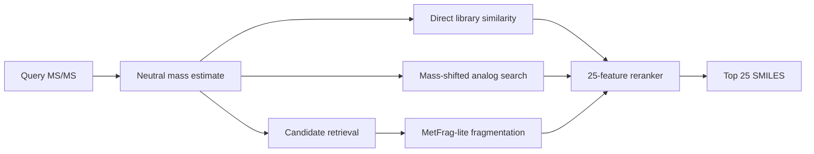

# Enveda CASMI 2026 — Molecule ID from Mass Spectra

Experimental solution for the [Enveda CASMI 2026 Kaggle competition](https://www.kaggle.com/competitions/enveda-CASMI26-molecule-id-mass-spectra), focused on **candidate retrieval and reranking** rather than direct molecular generation.

The task is exact-structure identification from MS/MS spectra. Because the evaluation uses **MRR@25**, the practical objective is to place the correct molecular structure as high as possible among the top 25 candidates.

## Current approach

The current notebook has evolved well beyond a basic spectral-cosine baseline. The pipeline combines three evidence channels:

1. **Direct library matching** — spectral entropy similarity against training spectra within a tight precursor-mass window.
2. **Mass-shifted analog propagation** — searches structurally related library spectra in a wider mass window and transfers evidence to candidate molecules using molecular fingerprints.
3. **In-silico fragmentation (MetFrag-lite)** — breaks candidate structures into fragments and scores how well theoretical fragments explain the observed peaks.

The evidence is transformed into a **25-feature candidate matrix** and ranked with `HistGradientBoostingClassifier`.

## Repository contents

- `enveda-casmi-2026-fast-spectral-cosine-baseline.ipynb` — current Kaggle notebook / main experiment.
- `EXPERIMENTS.md` — experiment log, verified results, hypotheses, and next tests.

The notebook currently runs against a unified candidate pool of roughly **712k structures** assembled from COCONUT and training structures. A full test pass over 400 molecules took about **54 minutes** in the saved Kaggle run.

## Progress

The notebook records the following evolution:

| Version | Main change | Public LB | Status |
|---|---|---:|---|
| V10–V11 | Library similarity + COCONUT precursor fallback | 0.163 | notebook-reported |
| V14 | Confidence-threshold gating | 0.193 | notebook-reported |
| V15 | Fragment/loss dual channel + multi-spectrum consensus | 0.205 | notebook-reported |
| V16 | Mass-shifted analog propagation + MetFrag-lite + calibrated ranker | — | current; leaderboard result not yet recorded in this repo |

> Important: any projected V16 score should be treated as a hypothesis until an actual Kaggle submission result is recorded.

## Current configuration highlights

- Candidate mass window: `±10 ppm`, with `±30 ppm` fallback
- Analog search window: `±200 Da`
- Up to `80` analog spectra per query
- Entropy-weighted spectral similarity
- Up to `256` peaks retained after cleaning
- RDKit molecular fingerprints
- Gradient boosting reranker with 25 input features
- Output: exactly 25 candidate SMILES per molecule

## Reproducibility

The notebook expects Kaggle-mounted inputs rather than checked-in datasets. In addition to the competition data, the current run references precomputed assets such as:

- COCONUT candidate metadata and fingerprints
- training-structure fingerprints
- `rank_train.npz` for reranker fitting
- an offline RDKit wheel

Large datasets, generated submissions, caches, and model artifacts should not be committed to Git.

## Highest-priority validation work

Before adding more model complexity, the current pipeline needs stronger local validation and ablation testing:

1. **Fix/verify diagnostics.** The saved run reports `best_library_sim == 1.0` for all 400 test molecules, which conflicts with the notebook's own Class-1/Class-2 interpretation and should be investigated before using that diagnostic for gating.
2. **Run channel ablations.** Measure library-only, analog-only, fragmentation-only, and combined reranker performance on the same held-out protocol.
3. **Test ensemble diversity.** Combine rankings produced by meaningfully different parameter sets instead of averaging nearly identical runs.
4. **Use out-of-fold calibration.** Tune reranker weights and thresholds on held-out data rather than from leaderboard feedback where possible.
5. **Track every Kaggle submission.** Record exact commit, parameters, runtime, local metric, and public/private LB when available.

## Planned ensemble experiment

The next low-cost experiment is a **multi-configuration rank ensemble**. Example members:

- mass tolerance: `5 / 10 / 20 ppm`
- peak tolerance: `0.005 / 0.01 / 0.02 Da`
- analog similarity power: `2 / 3 / 4`
- fragment-only vs fragment+neutral-loss evidence

Instead of directly averaging raw scores from differently calibrated models, use **rank fusion** (e.g. weighted reciprocal-rank fusion) and keep only members that make sufficiently different errors.

See [`EXPERIMENTS.md`](EXPERIMENTS.md) for the experiment protocol.

## Notes

This is a personal experimental research project built for the Kaggle competition. It is not an official Enveda or CASMI implementation.
